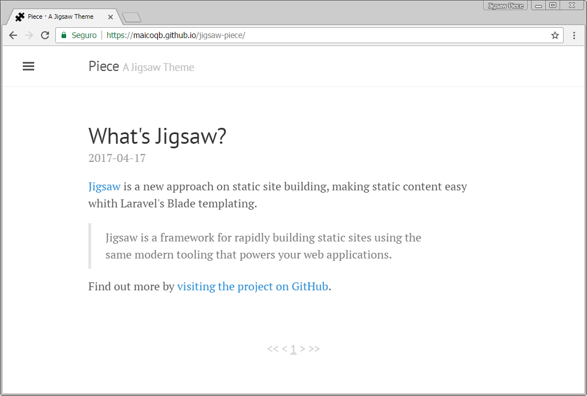
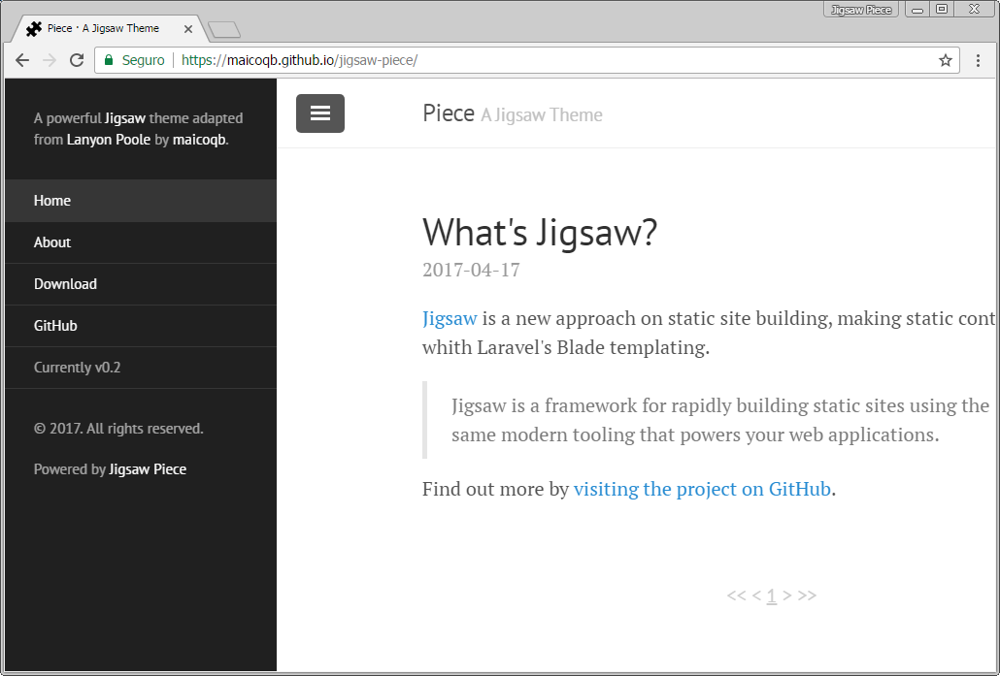
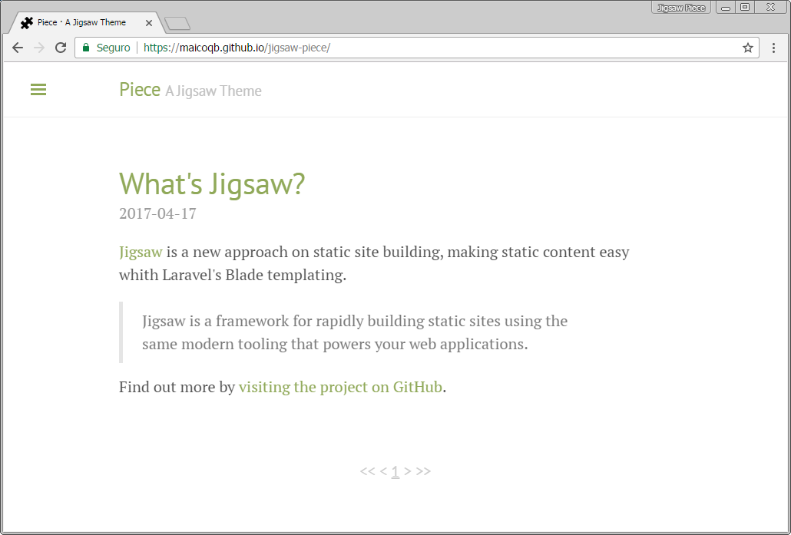
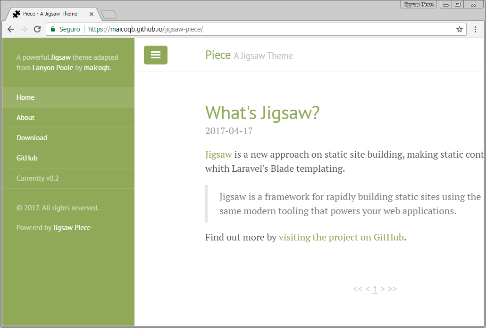
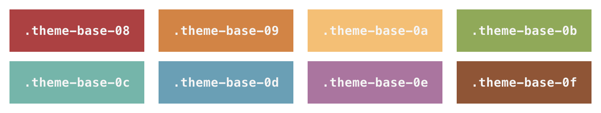
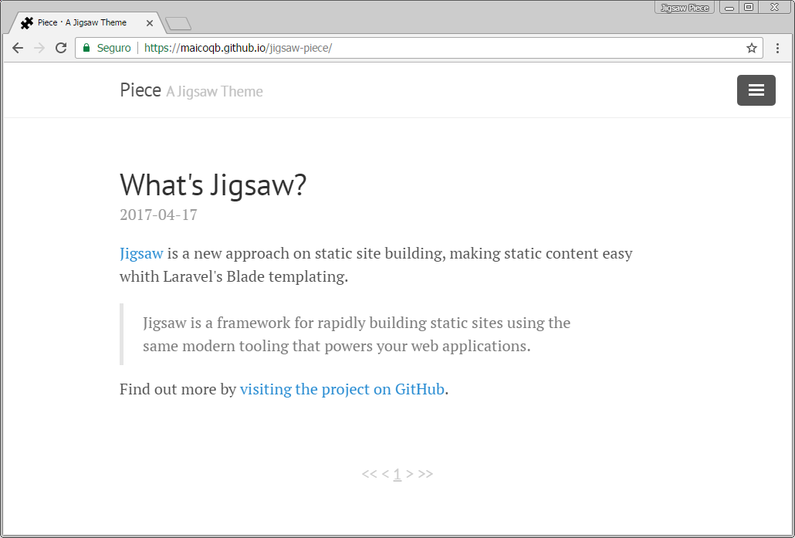
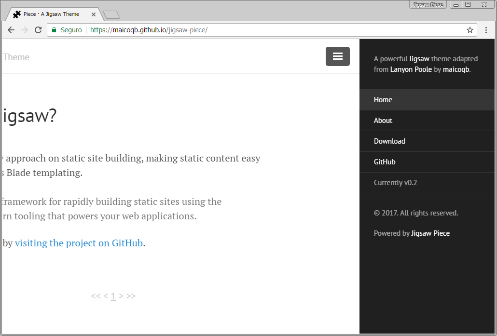

# Jigsaw Piece

Piece is an adaptation from [Lanyon Poole](http://lanyon.getpoole.com), and as says Lanyon's description:

> [~~Lanyon~~] Piece is an unassuming [~~[Jekyll](http://jekyllrb.com)~~] [Jigsaw](http://jigsaw.tighten.co) theme that places content first by tucking away navigation in a hidden drawer.





## Contents

- [Usage](#usage)
- [Options](#options)
  - [Themes](#themes)
  - [Reverse Layout](#reverse-layout)
  - [Sidebar Overlay](#sidebar-overlay-instead-of-push)
  - [Sidebar Open on Load](#sidebar-open-on-page-load)
- [Author](#author)
- [License](#license)


## Usage

Piece is a theme built on top of [Jigsaw](https://jigsaw.tighten.co), to more information go to Jigsaw's [documentation](http://jigsaw.tighten.co/docs/installation/).
> For the latest documentation go to [my forked repository](https://maicoqb.github.io/jigsaw/docs/installation/).

## Options

Piece theme includes some customizable options on the `<body>` element.

### Themes

Piece ships with eight optional themes based on the [base16 color scheme](https://github.com/chriskempson/base16).
Apply a theme to change the color scheme (mostly applies to sidebar and links).




There are eight themes available at this time.



To use a theme, add any one of the available theme classes to the `<body>` element in the `default.html` layout, like so:

```html
<body class="theme-base-08">
  ...
</body>
```

To create your own theme, look to the Themes section of [included CSS file](https://github.com/maicoqb/jigsaw-piece/blob/tagged/source/public/css/lanyon.css#L437).
Copy any existing theme (they're only a few lines of CSS), rename it, and change the provided colors.


### Reverse layout




Reverse the page orientation with a single class.

```html
<body class="layout-reverse">
  ...
</body>
```


### Sidebar overlay instead of push

Make the sidebar overlap the viewport content with a single class:

```html
<body class="sidebar-overlay">
  ...
</body>
```

This will keep the content stationary and slide in the sidebar over the side content. It also adds a `box-shadow` based outline to the toggle for contrast against backgrounds, as well as a `box-shadow` on the sidebar for depth.

It's also available for a reversed layout when you add both classes:

```html
<body class="layout-reverse sidebar-overlay">
  ...
</body>
```

### Sidebar open on page load

Show an open sidebar on page load by modifying the `<input>` tag within the `sidebar.html` layout to add the `checked` boolean attribute:

```html
<input type="checkbox" class="sidebar-checkbox" id="sidebar-checkbox" checked>
```

Using Blade syntax you can also conditionally show the sidebar open on a per-page basis.
For example, here's how you could have it open on the homepage only:

```php
<input type="checkbox" class="sidebar-checkbox" id="sidebar-checkbox" {{ $page->title == 'Home' ? 'checked' : '' }}>
```

## Author

**Maico Borges**
- <https://github.com/maicoqb>

### Theme Author

**Mark Otto**
- <https://github.com/mdo>
- <https://twitter.com/mdo>


## License

Open sourced under the [MIT license](LICENSE.md).

<3
